# TranscriptIQ

A multimodal inference pipeline that ingests heterogeneous audio sources  streaming URLs or raw file uploads and transforms unstructured acoustic signal into structured, queryable knowledge through automatic speech recognition, comparative abstractive summarization, and retrieval-grounded generative question answering.

---

## Problem Statement

Long-form audio podcasts, lectures, recorded interviews encodes high-value information inside an inherently low-bandwidth modality: continuous speech. Extracting or verifying a single fact demands linear traversal of the entire recording; there is no random-access mechanism into spoken content. Naive summarization tools compound this problem by collapsing the source into a single unverifiable text artifact, severing the link between claim and evidence and foreclosing any follow-up interrogation of the material.

## Solution

This system decouples acquisition, transcription, and reasoning into independent, composable stages and exposes three capabilities against any ingested source:

- **Automatic transcription** - speech is decoded into text via a transformer-based acoustic model, with existing transcripts short-circuited when available to avoid redundant computation.
- **Comparative abstractive summarization** - two architecturally distinct transformer models process identical input in parallel and are benchmarked against quantitative metrics rather than judged subjectively.
- **Retrieval-augmented generative Q&A** - natural language queries are answered by an LLM conditioned exclusively on semantically retrieved transcript passages, constraining generation to grounded evidence and suppressing hallucination.
- **Speech synthesis** - generated summaries and answers can be rendered back into spoken audio via Google Text-to-Speech (gTTS), closing the loop from audio input to audio output.

---

## Architecture

```mermaid
flowchart LR
    %% Define Node Styles (Dark theme with solid fill, colored borders, and rounded corners)
    classDef uiStyle fill:#1E2530,stroke:#3498DB,stroke-width:2px,color:#FFF,rx:8px,ry:8px;
    classDef ingestionStyle fill:#1A252C,stroke:#5DADE2,stroke-width:2px,color:#FFF,rx:8px,ry:8px;
    classDef transcriptionStyle fill:#2C3E50,stroke:#E74C3C,stroke-width:2px,color:#FFF,rx:8px,ry:8px;
    classDef processingStyle fill:#273746,stroke:#F39C12,stroke-width:2px,color:#FFF,rx:8px,ry:8px;
    classDef summarizationStyle fill:#1B2631,stroke:#2ECC71,stroke-width:2px,color:#FFF,rx:8px,ry:8px;
    classDef ragStyle fill:#212F3D,stroke:#9B59B6,stroke-width:2px,color:#FFF,rx:8px,ry:8px;
    classDef ttsStyle fill:#283747,stroke:#95A5A6,stroke-width:2px,color:#FFF,rx:8px,ry:8px;

    %% Subgraph 1: User Interface Layer
    subgraph UI ["Streamlit Web Interface"]
        direction TB
        U1["Input Forms<br>(URL / File)"]:::uiStyle
        U2["Summary & Metrics<br>Display"]:::uiStyle
        U3["Model Comparison<br>View"]:::uiStyle
        U4["Interactive Q&A<br>Chat Interface"]:::uiStyle
        U5["Audio Player<br>(TTS Playback)"]:::uiStyle
    end

    %% Subgraph 2: Ingestion & Normalization Layer
    subgraph Ingestion ["Data Acquisition & Preprocessing"]
        direction TB
        I1["Input Mode"]:::ingestionStyle

        %% YouTube Path
        I2["YouTube URL"]:::ingestionStyle
        I4["Transcript Exists?<br>(youtube-transcript-api)"]:::ingestionStyle
        I3["yt-dlp<br>(Extract Audio Stream)"]:::ingestionStyle

        %% Local Path
        I5["Audio File Upload<br>(mp3, wav, m4a, webm, ogg)"]:::ingestionStyle

        %% Normalization
        I6["ffmpeg<br>(Normalize to 16kHz Mono float32 PCM)"]:::ingestionStyle

        I1 -- "URL" --> I2
        I1 -- "File Upload" --> I5
        I2 --> I4
        I4 -- "No" --> I3
        I3 --> I6
        I5 --> I6
    end

    %% Subgraph 3: Transcription Layer
    subgraph Transcription ["Transcription Engine"]
        direction TB
        T1["OpenAI Whisper (base model)<br>Encoder-Decoder Transformer"]:::transcriptionStyle
        T2["Final Combined Transcript"]:::transcriptionStyle

        I6 --> T1
        T1 --> T2
        I4 -- "Yes (Short-circuit)" --> T2
    end

    %% Subgraph 4: Processing Layer
    subgraph Processing ["Text Segmentation & Chunking"]
        direction TB
        P1["Token-aware Segmentation<br>(350 words, 60 word overlap)"]:::processingStyle

        T2 --> P1
    end

    %% Subgraph 5: Summarization Layer
    subgraph Summarization ["Comparative Summarization Models (HuggingFace)"]
        direction TB
        S1["BART-large-CNN<br>(406M Params, Abstractive)"]:::summarizationStyle
        S2["T5-base<br>(220M Params, Abstractive)"]:::summarizationStyle
        S3["BART Summary<br>(60-75% compression)"]:::summarizationStyle
        S4["T5 Summary<br>(85-95% compression)"]:::summarizationStyle

        P1 --> S1 & S2
        S1 --> S3
        S2 --> S4
    end

    %% Subgraph 6: RAG & QA Layer
    subgraph RAG ["Retrieval-Augmented Generation (RAG) Pipeline"]
        direction TB
        R1["SentenceTransformers<br>(all-MiniLM-L6-v2)"]:::ragStyle
        R2["FAISS<br>Vector Index"]:::ragStyle
        R3["User Query"]:::ragStyle
        R4["Query Embedding"]:::ragStyle
        R5["Semantic Similarity Search<br>(Top-K Retrieval)"]:::ragStyle
        R6["Groq API<br>(Llama 3.3 70B LLM)"]:::ragStyle
        R7["Evidence-Grounded Answer"]:::ragStyle

        P1 --> R1
        R1 --> R2
        R3 --> R4
        R4 --> R5
        R2 --> R5
        R5 --> R6
        R6 --> R7
    end

    %% Subgraph 7: Speech Synthesis Layer
    subgraph TTS ["Speech Synthesis"]
        direction TB
        TTS1["Google Text-to-Speech<br>(gTTS)"]:::ttsStyle
        TTS2["Generated MP3 Audio Summary"]:::ttsStyle

        S3 --> TTS1
        S4 --> TTS1
        TTS1 --> TTS2
    end

    %% Interconnections between Subgraphs and UI
    U1 --> I1
    S3 --> U2
    S4 --> U2
    S3 --> U3
    S4 --> U3
    R7 --> U4
    TTS2 --> U5

    %% UI to components interactions
    R3 -.-> U4
```



---

## Multimodal Architecture

The pipeline fuses two distinct modalities - raw acoustic signal and derived natural-language text - into a single reasoning substrate. Audio is decoded through a mel-spectrogram-driven encoder-decoder transformer (Whisper) and projected into UTF-8 text; that text is subsequently re-encoded into dense vector space via a Sentence-Transformer model for semantic retrieval, and independently routed into sequence-to-sequence summarization models. The system therefore executes three distinct model families across two modalities - acoustic-to-text, text-to-text summarization, and text-to-vector embedding — and reconciles their outputs behind a unified interface, rather than treating audio as a single-purpose input to one downstream model.

## Data Acquisition Layer

Acquisition is engineered as a fault-tolerant, source-agnostic front end rather than a thin file-loader:

- **Dual-pathway ingestion** - a streaming extractor (`yt-dlp`) resolves and downloads audio directly from URLs, while a parallel binary-upload path accepts arbitrary local files; both converge into a single normalization contract.
- **Transcript short-circuiting** - where a platform-native transcript already exists, the pipeline bypasses ASR entirely, eliminating unnecessary GPU/CPU cycles and reducing end-to-end latency.
- **Format normalization** - heterogeneous containers (`.mp3`, `.mp4`, `.wav`, `.m4a`, `.webm`, `.ogg`) are coerced through `ffmpeg` into a canonical 16 kHz mono float32 PCM representation, guaranteeing a deterministic input contract for the ASR stage regardless of source codec or sample rate.
- **Stateless, cache-isolated execution** - intermediate audio artifacts are staged through a configurable temporary cache directory, decoupling ingestion throughput from downstream model inference and permitting horizontal scaling of the acquisition tier independent of the modeling tier.

## Technical Highlights

- **Native ASR implementation** - audio is decoded through Whisper's convolutional feature encoder and autoregressive cross-attention decoder, not delegated to a third-party transcription API.
- **Empirical model benchmarking** - BART-large-CNN and T5-base are evaluated head-to-head on identical input, quantified via compression ratio, wall-clock inference latency, and sentence-count delta, yielding a reproducible comparative framework rather than a single opaque output.
- **Evidence-grounded generation** - FAISS-indexed dense retrieval constrains the LLM's context window to top-k semantically relevant passages before invoking Llama 3.3 70B via Groq, architecturally suppressing unconstrained hallucination.
- **Production-grade engineering discipline** - externalized configuration (`.env` / `config.py`), a pytest suite with fully mocked external dependencies, coverage instrumentation, static linting, and a GitHub Actions CI pipeline gating every commit.

## Comparative Model Analysis

Both BART-large-CNN and T5-base are **abstractive** summarizers: they generate novel phrasing conditioned on the source text rather than performing **extractive** summarization, which would simply select and concatenate existing sentences verbatim. This distinction matters — abstractive models can compress and rephrase for readability but carry higher risk of paraphrastic drift, which is precisely why the pipeline benchmarks them empirically rather than trusting either output blindly.

| Property | BART-large-CNN | T5-base |
|---|---|---|
| Parameters | 406M | 220M |
| Summarization type | Abstractive (extractive-leaning, high lexical fidelity) | Abstractive (highly compressive, aggressive rephrasing) |
| Fine-tuning corpus | CNN / DailyMail | C4 with summarization prefix prompting |
| Max input tokens | 1024 | 512 |
| Compression ratio | 60-75% | 85-95% |
| Decoding strategy | Beam search (num_beams=4) | Greedy / beam (num_beams=2) |

The application surfaces this comparison directly in a dedicated **Model Comparison** view, reporting compression ratio, inference latency, and sentence-count delta side by side for the same input — turning model selection into a data-driven decision rather than a fixed default.

## Research Gap

The majority of transcript-summarization systems commit to a single model and treat its output as ground truth, obscuring the compression-versus-fidelity-versus-latency trade-off inherent to abstractive summarization. This pipeline instead instruments two architecturally divergent models under identical experimental conditions, exposing that trade-off empirically rather than asserting it. Layering a retrieval-grounded Q&A subsystem atop this comparative framework further demonstrates a hybrid reasoning strategy — abstractive compression for global context, dense retrieval for verifiable, localized fact recovery — rather than overloading a single paradigm to serve both objectives.

---

## Tech Stack

| Layer | Components |
|---|---|
| Interface | Streamlit |
| Acquisition | yt-dlp, ffmpeg |
| Speech-to-text | OpenAI Whisper (encoder-decoder transformer) |
| Summarization | BART-large-CNN, T5-base (HuggingFace Transformers) |
| Retrieval / Generation | Sentence-Transformers, FAISS, Groq API (Llama 3.3 70B) |
| Speech synthesis | gTTS (Google Text-to-Speech) |
| Testing / CI | pytest, pytest-cov, flake8, GitHub Actions |

---

## Project Structure

```
audio-nlp-processing-pipeline/
├── .github/
│   └── workflows/               # GitHub Actions CI pipeline (test + lint on push/PR)
├── app/
│   └── app.py                   # Streamlit entry point and UI orchestration
├── src/
│   ├── ingestion/
│   │   ├── youtube.py           # yt-dlp extraction, transcript short-circuiting
│   │   └── transcribe.py        # Whisper ASR implementation
│   ├── processing/
│   │   ├── chunking.py          # Token-aware and word-based text splitters
│   │   └── summarize.py         # BART / T5 abstractive summarization pipelines
│   └── retrieval/
│       └── rag.py               # FAISS indexing, retrieval, Groq-based QA synthesis
├── tests/
│   ├── test_chunking.py
│   ├── test_ingestion.py
│   └── test_rag.py
├── config.py                    # Centralized configuration (models, tokens, thresholds)
├── requirements.txt              # Pinned dependencies
├── runtime.txt                   # Python runtime specifier
├── pytest.ini                    # Test discovery and coverage configuration
├── .env                          # Local secrets (GROQ_API_KEY) — not committed
└── README.md

```

---

## Setup

```bash
git clone https://github.com/shravan606756/audio-nlp-processing-pipeline.git
cd audio-nlp-processing-pipeline
python3.10 -m venv venv && source venv/bin/activate
pip install -r requirements.txt
echo "GROQ_API_KEY=your_key_here" > .env
streamlit run app/app.py
```

Requirements: Python 3.10+, `ffmpeg` on system PATH, and a Groq API key for Q&A functionality.

---

## Testing

```bash
pytest --cov=src --cov-report=term-missing
```

The suite mocks all external dependencies (Whisper, HuggingFace pipelines, yt-dlp, FAISS) and executes automatically via CI on every push and pull request.

---

## License

See `LICENSE` for terms of use and distribution.
